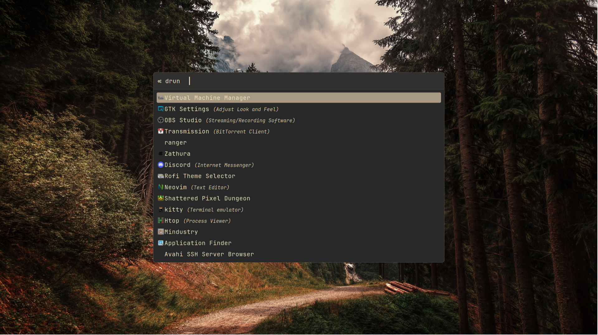

# Gruvbox Material Rofi theme

<p align="center">A simple Gruvbox Material <a href="https://github.com/davatorium/rofi">Rofi</a> color theme.</p>

Based on the <a href="https://github.com/sainnhe/gruvbox-material">Gruvbox Material</a> color palette.</p>

---

<p align="center"><blockquote>Font: <a href="https://www.jetbrains.com/lp/mono/">JetBrains Mono</a> 10px.</blockquote></p>

## Getting started
### Installation

1. Copy <a href="gruvbox-material.rasi">gruvbox-material.rasi</a> file to `~/.config/rofi/gruvbox-material.rasi`
2. Add the following lines to your rofi config (`~/.config/rofi/config.rasi`):
```
configuration {
    font: "Envy Code R 10";
    line-margin: 10;

    display-ssh:    "";
    display-run:    "";
    display-drun:   "";
    display-window: "";
    display-combi:  "";
    show-icons:     true;
}

@theme "~/.config/rofi/gruvbox-material.rasi"
```
