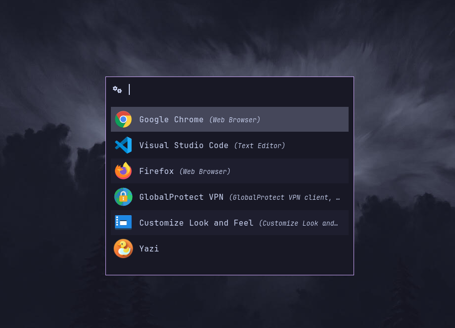

# Rofi Catppuccin Mocha Theme

A rofi theme based on **[@hiimsergey's rofi-gruvbox-material](https://github.com/hiimsergey/rofi-gruvbox-material)**



## Setup

1. Put <a href="catppuccin-mocha.rasi">catppuccin-mocha.rasi</a> inside `~/.config/rofi/`
2. Add the following to your rofi config (`~/.config/rofi/config.rasi`):

```
configuration {
    display-ssh:    " ";
    display-run:    " ";
    display-drun:   " ";
    display-window: " ";
    display-combi:  " ";
    show-icons:     true;
    font: "JetBrainsMono Nerd Font 12";
}

@theme "~/.config/rofi/catppuccin-mocha.rasi"
```
